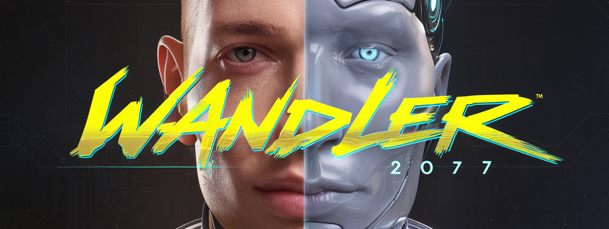

# Wandler

<p align="center">
  
</p>

**Wandler empowers web developers to integrate powerful language AI into browsers with simplicity
and performance.**  
We provide a minimalist, privacy-focused abstraction layer over cutting-edge technologies
(Transformers.js + WebGPU) to enable:

## Key Features

1. **Zero-Config Intelligence**  
   Run state-of-the-art language models with one line of code

   ```typescript
   const ai = new Wandler();
   ai.text("Hello world");
   ```

2. **Browser-Native Performance**  
   Automatic WebGPU acceleration and KV caching for near-native speed  
   (Without requiring ML/GPU expertise)

3. **Privacy by Default**  
   Client-side execution ensures data never leaves the user's device

4. **Progressive Customization**  
   Start simple, then tweak streaming/quantization/caching as needed  
   (Without upfront complexity)

## Coming Soon

- 🎨 **Framework Support**

  - `@wandler/react` - React components and hooks for seamless integration
  - `@wandler/vue` - Vue components and composables
  - `@wandler/svelte` - Svelte components and stores

- 🎭 **Multimodal Support**

  - `loadImage()` - Vision-language models (BLIP, InstructBLIP)
  - `loadAudio()` - Speech recognition and synthesis
  - `loadVideo()` - Video understanding and generation

- 🚀 **Advanced Features**
  - Worker thread orchestration
  - Automatic model quantization
  - Progressive downloading
  - Fine-tuning in browser

## Target Audience

**For developers who:**

- Want LLM capabilities without managing servers/APIs
- Prioritize user privacy and low-latency interactions
- Need to balance model power with bundle size/performance

**We abstract:**

- WebGPU shader compilation
- Model quantization/optimization
- Worker thread orchestration
- Streaming token management

**To deliver:**

- A React/Vue-like simplicity for browser AI
- Desktop-grade performance in web apps
- Future-proof foundation for client-side AI

_"What jQuery did for DOM manipulation, Wandler does for browser-based AI."_

## Installation

```bash
npm install wandler
```

## Quick Start

```typescript
import { Wandler } from "wandler";

// Initialize with default settings
const ai = new Wandler("meta-llama/Llama-2-7b-chat-hf");

// Basic text generation
const response = await ai.text([{ role: "user", content: "Hello, how are you?" }]);

// Streaming with progress updates
const streamingResponse = await ai.text([{ role: "user", content: "Tell me a story" }], {
	stream: true,
	onToken: token => console.log(token),
});
```

## Advanced Configuration

```typescript
const ai = new Wandler("meta-llama/Llama-2-7b-chat-hf", {
	useKV: true, // Enable key-value caching
	dtype: "q4f16", // 4-bit quantization
	device: "webgpu", // Use WebGPU acceleration
	onProgress: progress => console.log(`Loading: ${progress}%`),
});
```

## Development

```bash
# Start development server
npm run dev

# Build for production
npm run build

# Run tests
npm test
npm run test:unit     # Run unit tests only
npm run test:browser  # Run browser tests only
```

## Contributing

Contributions are welcome! Please read our contributing guidelines for details on our code of
conduct and development process.

## License

This project is licensed under MIT.
