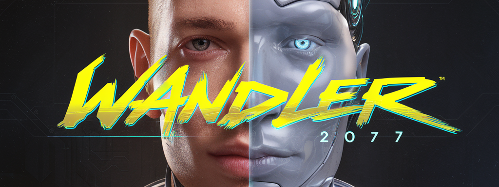

# @wandler

<p align="center">
  
</p>

<p align="center">
  <h3 align="center"><strong>Democratize AI with the browser</strong></h3>
</p>

<p align="center">
  Wandler makes it ridiculously easy to run AI directly in your browser.
</p>

## Quick Start

```bash
npm install @wandler
```

```typescript
import { loadModel, streamText } from "@wandler";

// Load any model
const model = await loadModel("onnx-community/DeepSeek-R1-Distill-Qwen-1.5B-ONNX", {
	onProgress: info => console.log(`${info.file}: ${info.loaded}/${info.total} bytes`),
});

// Stream text
const result = await streamText({
	model,
	messages: [{ role: "user", content: "What is the meaning of life?" }],
});

for await (const token of result) {
	console.log(token);
}
```

## Features

- 🎮 **Run AI Models Locally** - No server, no API keys, complete privacy
- ⚡ **WebGPU Acceleration** - Blazing fast inference using your GPU
- 🔌 **battle tested foundation** - Runs on top of
  [Transformers.js](https://github.com/huggingface/transformers.js) (and more to come)
- 🎯 **Smart Model Detection** - Automatically detects model capabilities
- 🧩 **Provider System** - Extensible architecture for different model types

## Coming Soon

- 🎨 **Framework Support**

  - `@wandler/react` - React components and hooks
  - `@wandler/vue` - Vue components and composables

## Documentation

- [Examples](examples/)

## Contributing

We love contributions! Check out our [Contributing Guide](CONTRIBUTING.md) to get started.

## 📄 License

MIT © [Tim Pietrusky](https://github.com/timpietrusky)

---

<div align="center">
  <strong>let's democratize AI</strong>
</div>
